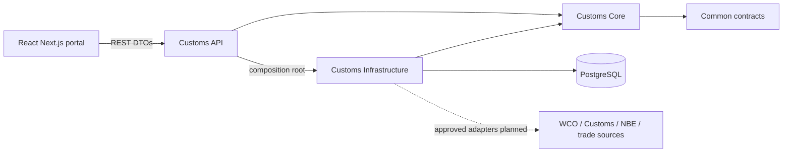

# Architecture and organization alignment

## Reference evidence

Inspected read-only on September 7, 2026:

- `C:/Users/hp/Documents/SystemsEdge/winssas-admin-services/SES.WINSSAS/Apps/AdminManagement/`
- `C:/Users/hp/Documents/SystemsEdge/winssas-admin-services/SES.WINSSAS/Infrastructure/`
- `C:/Users/hp/Documents/SystemsEdge/winssas-organization-portal/`

No source organization files, credentials, business records or environment configuration were copied into the starter. `SES.Customs` is a proposed namespace following the existing `SES.WINSSAS` naming style; confirm final product naming with SystemsEdge.

| Observed organization pattern | Customs skeleton |
| --- | --- |
| `Apps/AdminManagement/*.Core`, `*.Infrastructure`, `*.API` | `Apps/Customs/SES.Customs.Core`, `.Infrastructure`, `.API` |
| Core `Models`, `Dtos`, `Features/Banks/Contract/{Query,Command,Repository}` | Same feature conventions; working `HsCodes` query slice |
| `Features/Banks/Handler/Query/GetAllBanksQueryHandler.cs` using MediatR | `Features/HsCodes/Handler/Query/HsQueryHandlers.cs` |
| Controllers inject `IMediator` | Customs controllers dispatch MediatR queries |
| Infrastructure `Context`, `Repository`, `Dependency/DependencyInjection.cs` | Same names and DI registration boundary |
| Npgsql/EF Core in persistence | PostgreSQL model and `HsCodeRepository` |
| Common library and shared infrastructure projects | Small independent `SES.Customs.Common`; infrastructure remains explicit |
| Portal `app/layout.tsx`, `app/providers.tsx`, `components/AppLayout.tsx` | Same App Router entry points and provider/layout boundaries |
| `lib/store/api/baseQuery.ts`, RTK Query services | Typed `baseQuery.ts` and `hsCodesApi.ts` |
| Mantine, React 19, Next.js 15, TypeScript | Same framework family and UI provider; patch version gate documented |
| `lib/i18n/client.ts`, `locales/en.json`, `am.json` | English and Amharic resources and language selector |
| OIDC/Keycloak role mapping and portal session helpers | Explicit IAM adapter boundary; implementation scheduled for phase 1 |

## Dependency rule

Core contains domain models and application use cases, matching the organization's three-project arrangement. It owns repository contracts and depends only on Common and MediatR. Infrastructure implements these contracts. API binds HTTP, authentication and dependency injection. Portal components call typed query services rather than embedding endpoint parsing or domain calculations.

The existing AdminManagement Core references `Infrastracture.Base.EF`; reproducing that dependency would couple application logic to persistence. This skeleton deliberately removes that dependency while retaining familiar folder names. No separate Domain/Application projects are added at this stage; a future split can preserve the same feature contracts if complexity warrants it.

## Deliberate adaptations

- Start as one modular application and one API host. Separate deployable services are not assumed from the reference solution's many apps. Split later only for demonstrated operational needs.
- Use SRS resource routes such as `/api/hs-codes`, instead of reference action routes such as `GetAllBanks`.
- Return typed DTOs and a single pagination shape, avoiding tracked-entity serialization and `$values` response normalization.
- Keep EF entities and connection strings out of the browser and Core contracts; no wildcard production CORS.
- No automatic startup migration, imported MinIO requirement, background job server, copied IAM realm or copied secrets.
- Roles use the SRS names `CustomsOfficer`, `CustomsAdministrator`, `SystemAdministrator`; mapping to organization IAM claims is an open decision.
- No generic base repository returning `IQueryable` to Core. Repository methods express use-case needs.
- RTK Query is the server-state layer. Additional React Query or Redux persistence is unnecessary in this skeleton. OIDC session tokens are not placed in local storage.

## Request flow demonstrated

`app/hs-codes/page.tsx` → `lib/store/api/hsCodesApi.ts` → `HsCodesController` → `SearchHsCodesQuery` → `SearchHsCodesQueryHandler` → `IHsCodeRepository` → synthetic read-only repository in demo mode, or EF repository when explicitly configured.

The demo is isolated by environment and configuration. Production startup fails until security work is completed. Protected module routes remain authentication-protected scaffolds. There is no implemented login screen, write path, background import or report export.
